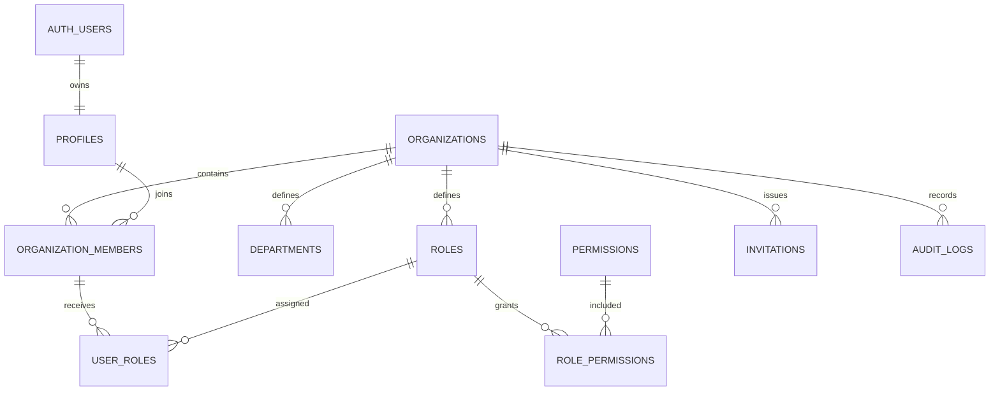

# مخطط المرحلة الأولى

كل صف تشغيلي مرتبط بـ`organization_id`. القراءة والتعديل يخضعان لسياسات RLS التي تستدعي `is_org_member` أو `has_permission`. لا تثق الدوال في معرف الشركة المرسل من المتصفح؛ العضوية تؤخذ من `auth.uid()` داخل قاعدة البيانات. سجل النشاط لا يملك سياسات إدراج عامة ولا يقبل update/delete.

## طبقات الحماية

1. Proxy يجدد جلسة Supabase ويعيد غير المسجل إلى الدخول.
2. Server Actions تتحقق من Zod ومن المستخدم والصلاحية.
3. RLS يمنع الوصول المتقاطع أو تجاوز الواجهة.
4. القيود والمفاتيح الخارجية تمنع السجلات اليتيمة والتعارضات.
5. مشغلات المعاملات تنشئ الشركة أو تقبل الدعوة بشكل ذري.
