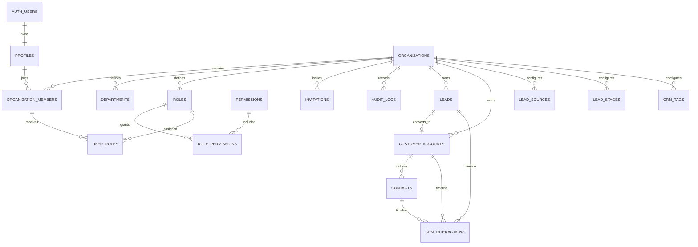

# مخطط النظام حتى المرحلة الثانية

كل صف تشغيلي مرتبط بـ`organization_id`. القراءة والتعديل يخضعان لسياسات RLS التي تستدعي `is_org_member` أو `has_permission`. لا تثق الدوال في معرف الشركة المرسل من المتصفح؛ العضوية تؤخذ من `auth.uid()` داخل قاعدة البيانات. سجل النشاط لا يملك سياسات إدراج عامة ولا يقبل update/delete.

## طبقات الحماية

1. Proxy يجدد جلسة Supabase ويعيد غير المسجل إلى الدخول.
2. Server Actions تتحقق من Zod ومن المستخدم والصلاحية.
3. RLS يمنع الوصول المتقاطع أو تجاوز الواجهة.
4. القيود والمفاتيح الخارجية تمنع السجلات اليتيمة والتعارضات.
5. مشغلات ودوال المعاملات تنشئ الشركة، تقبل الدعوة، تحول Lead، تدمج السجلات وتستورد CSV بصورة ذرية.

تستخدم جداول الربط `lead_tags` و`customer_tags` و`contact_tags` مفاتيح مركبة تشمل `organization_id`، لذلك لا يمكن ربط وسم من شركة بسجل شركة أخرى حتى لو عُرف UUID. التحويل يحتفظ بمرجع Lead الأصلي، وينقل الوسوم والتفاعلات، ثم يمنع التحويل المتكرر بقفل الصف داخل المعاملة.

## تعدد اللغات

- `src/lib/i18n/config.ts`: اللغات المدعومة، الاتجاه، لغة `Intl`، واختيار الاسم المحلي.
- `src/lib/i18n/server.ts`: قراءة اللغة المفضلة من Cookie على الخادم.
- `src/lib/i18n/actions.ts`: تغيير اللغة عبر Server Action مع منع Open Redirect.
- `src/components/locale-runtime.tsx`: سياق اللغة وترجمة نصوص الواجهة الحالية.
- Migration `202608060003_multilingual.sql`: أسماء إنجليزية للمصادر والمراحل، وأسماء عربية/إنجليزية للوسوم، دون تغيير RLS.

العربية هي لغة المصدر واللغة الافتراضية. عند غياب الترجمة تعرض الواجهة قيمة اللغة الأخرى بدل ترك الحقل فارغًا.
