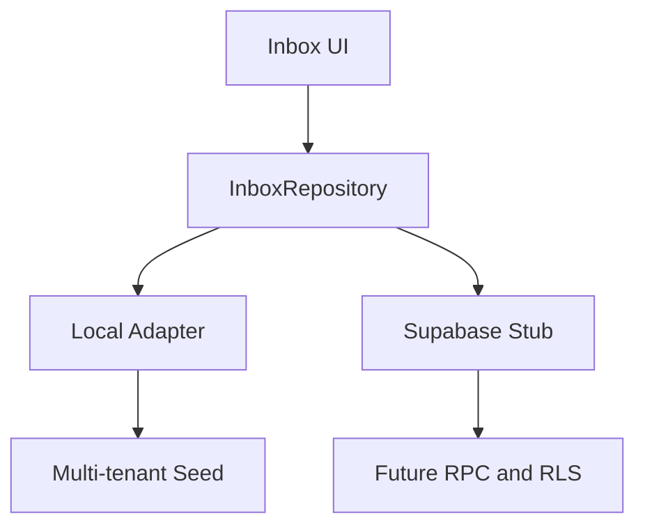

# معمارية المرحلة الثالثة

`DATA_PROVIDER` يحدد مزود مساحة العمل. الصندوق لا يعرف تفاصيل Supabase. `LocalInboxRepository` ينفذ التحقق والصلاحيات والعزل وIdempotency وسجل التدقيق، و`SupabaseInboxRepository` يفشل بوضوح حتى مرحلة التكامل. Migration 004 يعرّف مخطط القاعدة وRLS القراءة؛ الكتابة ستتم لاحقًا عبر RPCs أمنية فقط.
